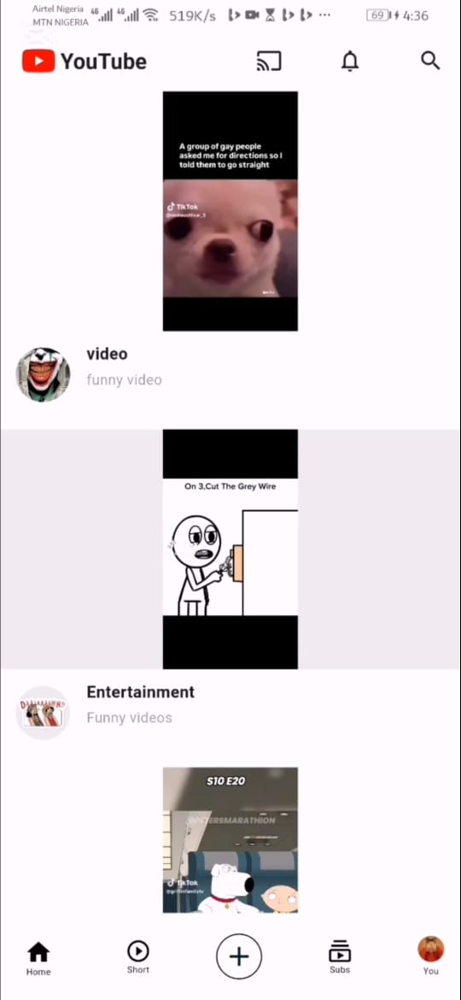
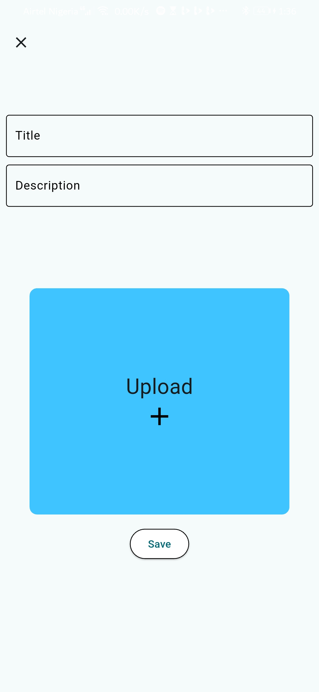
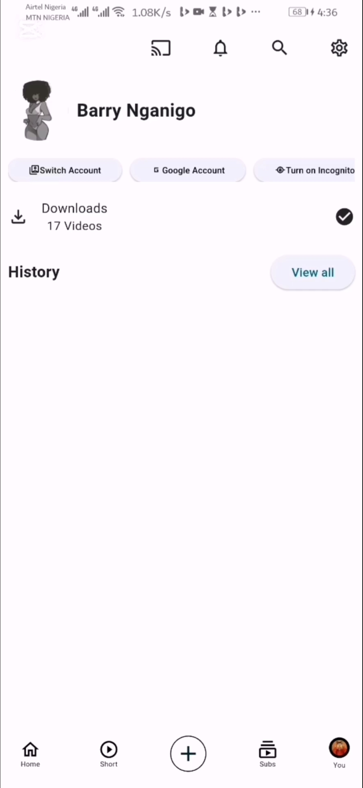

# YouTube Clone App (Flutter)

A vide-sharing mobile application with flutter and Firebase that allows
users to upload, watch, like, dislike, and comment on videos in real time.

## Features
### Authentication
- Email & Password Authentication
- Secure user login and registration
- User profile creation

### User Profile
- Profile image upload
- Display user information across the app
- Personalized content experience

### Video Features
- Upload videos
- Stream uploaded videos
- Pause, play and seek videos
- Video description

### Community Features
- Like videos
- Dislike videos
- Comment on videos
- Real-time updates

### Cloud Backend
- Firebase Authentication
- Firebase Realtime Database
- Firebase Storage

---
## Tech Stack
### Frontend
- Flutter
- Dart

### Backend & Services
- Firebase Authentication
- Firebase Storage
- Firebase Realtime Database

### Tools
- Android Studio
- Git & GitHub

---
## Project Architecture
lib/
|
├── models/
├── posts/
├── screens/
├── services/
├── widgets/
└── main.dart

---
## Screenshots

### Home Feed

### Upload Video

### User Profile

## Demo Video
Watch the project demo below:

[view Demo]
https://drive.google.com/file/d/111BHMMO9ezbi68rj_EM2EJL2PPs8leph/view?usp=drivesdk,
https://drive.google.com/file/d/1n4T0ql7uaurAH3hJh30EOfB5Fzs1xi_d/view?usp=drivesdk

## What I learned

During the development of this project, I gained practical experience in:

- Firebase Authentication
- Realtime database design
- Firebase Storage integration
- Video upload and playback
- State management with flutter
- Asynchronous programming
- Building scalable Flutter application
- Working with cloud-based backend services

## Author
Barisuka Lucky Nganigo

GitHub: https://github.com/Barry3232
Linkedln: https://linkedln.com/in/barisuka-nganigo-8b36a2333
Email: barryluck37@gmail.com

